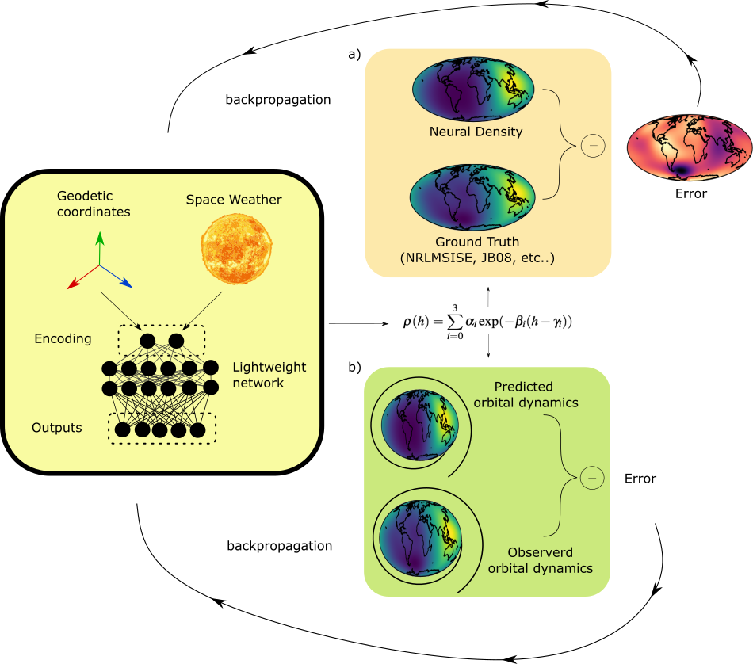

# thermoNETS

<!-- PROJECT LOGO -->
<br />
<p align="center">
  <a href="https://github.com/esa/thermonets">
    
  </a>
  <p align="center">
    Thermosphere neural implicit representation
    <br />
    <a href="https://github.com/esa/thermonets/issues/new/choose">Report bug</a>
    ·
    <a href="https://github.com/esa/thermonets/issues/new/choose">Request feature</a>
  </p>
</p>

## Info

This repository introduces a novel neural architecture termed thermoNET, designed to represent thermospheric density in satellite orbital propagation, using a reduced amount of differentiable computations.

Due to the appearance of a neural network on the right-hand side of the equations of motion, the resulting satellite dynamics is governed by a NeuralODE, a neural Ordinary Differential Equation, characterized by its fully differentiable nature, allowing the derivation of variational equations (hence of the state transition matrix) and facilitating its use in connection to advanced numerical techniques such as Taylor-based numerical propagation and differential algebraic techniques. Efficient training of the network parameters occurs through two distinct approaches.

This repository contains the code to train, analyze, and use thermoNETs for downstream tasks: including orbit propagation and neuralODE training. This was developed during the European Spage Agency's ACT study:

```bibtex
@inproceedings{thermonets,
  title = {NeuralODEs for VLEO simulations: Introducing thermoNET for Thermosphere Modeling},
  author = {Izzo, Dario and Acciarini, Giacomo and Biscani, Francesco},
  booktitle = {29th International Symposium on Space Flight Dynamics},
  year = {2024}
}
```
## Goals
https://github.com/esa/thermonets/assets/3327087/09267ff1-4939-49a6-b8fd-be0cb26f2a60

* represent thermospheric density empirical models via a lightweight neural network (only a few thousand parameters)
* neural ODE training to adjust trained architectures to match observed and/or simulated satellite data
* neural representation of NRLMSISE-00 and JB-08 (pre-trained) and available
* tutorial on the use of thermoNET for pure inference (i.e., as a thermospheric density model), during orbit propagation, for neural ODE fix (see `notebooks` folder)
https://github.com/esa/thermonets/assets/3327087/09267ff1-4939-49a6-b8fd-be0cb26f2a60

## Installation

First, clone the repository:

```console
git clone https://github.com/esa/thermonets
```

Then enter the repository and activate the conda environment:

```console
cd thermonets
conda env create -f environment.yml
```

Then, the module should be ready to import...

```Python
import sys
sys.path.append('..')
import thermonets as tn
```

## Getting Started

### thermoNET: thermospheric density computation

To run one of the two pre-trained thermoNETs (i.e., either the JB-08 or the NRLMSISE-00 ones) you can first define the needed inputs - these vary depending on the model trianed. In our case, we support NRLMSISE-00 and JB-08. 

NRLMSISE-00 inputs needed are:
* altitude (in km)
* longitude (in radians, between 0 and 2*pi)
* latitude (in radians, between -pi/2 and pi/2)
* F10.7 and F10.7a indexes
* Ap index
* seconds in day
* day of year

whereas JB-08 inputs needed are:
* altitude (in km)
* longitude (in radians, between 0 and 2*pi)
* latitude (in radians, between -pi/2 and pi/2)
* F10.7 and F10.7a indexes
* S10.7 and S10.7a indexes
* M10.7 and M10.7a indexes
* dDst/dT index
* seconds in day
* day of year

An example of an input preparation is as follows:
```Python
import sys
sys.path.append('..')
import thermonets as tn
import datetime
import numpy as np

date=datetime.datetime(2019, 8, 8, 20, 34, 42, 272745)
############### NRLMSISE-00 and JB-08 inputs ###############
#geodetic altitude in km
hs=np.linspace(180.,1000.,300) #300 points in the 180-1,000 km range
#geodetic longitude in [0,360] degrees and latitude in [-90,90] degrees --> in radians
lons=np.deg2rad(300.)
lats=np.deg2rad(15.)
#the F10.7 solar proxy:
f107 = 164.2
f107a = 152.8
#let's extract the day of the year and seconds in day from the date:
doy = date.timetuple().tm_yday
sid = date.hour * 3600 + date.minute * 60 + date.second + date.microsecond / 1e6

############### NRLMISE-00 only, remaining inputs ###############
#the Ap index
ap=13.

############### JB-08 only, remaining inputs ###############
s107=172.6
s107a=153.8
m107=159.8
m107a=137.
y107=139.3
y107a=137.
#finally the geomagnetic parameter referring to Dst index variations with the temperature: dDst /dT
dDstdT=115.
```

then the thermoNET model for NRLMSISE-00 and JB-08 models can be called by simply doing:
```Python
density_thermonet_nrlmsise00=tn.nrlmsise00_tn(hs=hs,
                                              lons=lons,
                                              lats=lats,
                                              f107=f107,
                                              f107a=f107a,
                                              ap=ap,
                                              doy=doy,
                                              sid=sid,)
density_thermonet_jb08=tn.jb08_tn(hs=hs,
                                  lons=lons,
                                  lats=lats,
                                  f107=f107,
                                  f107a=f107a,
                                  s107=s107,
                                  s107a=s107a,
                                  y107=y107,
                                  y107a=y107a,
                                  m107=m107,
                                  m107a=m107a,
                                  dDstdT=dDstdT,
                                  doy=doy,
                                  sid=sid,)
```
> NOTE that the output of the thermonet will be of shape NxMxL, where N is the length of the altitude vector, M is the length of the longitude vector, and L is the length of the latitude vector.
> Alternatively, floats can also be passed, and then the corresponding dimension will be equal to 1. The above shape for the thermoNET output for instance, is 300x1x1

The above produces the following density profiles as a function of the altitude:
<p align="center">
  
</p>

The pre-trained models display very low errors w.r.t. their ground truth (i.e., NRLMSISE-00 and JB-08): usually in the order of between 1 and 3% mean absolute percentage error. This is a table extracted from our publication:
<p align="center">
  
</p>

Check out our publication for a more thorough discussion! 

### Generate a Database
This repository open-sources two pre-trained thermoNET (one on the [NRLMSISE-00](https://pypi.org/project/nrlmsise00/) empirical model, and one on [JB-08](https://github.com/lcx366/ATMOS/tree/master)). In order to train a thermoNET from scratch for these two models, you can follow the tutorials under `notebooks/nrlmsise00_train.ipynb` and `noteboooks/jb08_train.ipynb`. However, it is essential to first generate a database of points to train on. This can be done by doing for NRLMSISE-00:

```console
cd scripts
python generate_nrlmsise00_db.py --n_lonlat_points 100 --min_height 180 --max_height 1000 --num_processes 1 --n_height_points 100
```

and for JB-08:
```console
cd scripts
python generate_jb08_db.py --n_lonlat_points 100 --min_height 180 --max_height 1000 --num_processes 1 --n_height_points 100
```
where `min_height`, `max_height` are in km. This might take several minutes for many points (e.g. the above is for several million points).. if you want something faster, you can reduce either the `n_lonlat_points` or `n_height_points` points requested.

### Orbit propagation

## Tutorials

Check out our `notebooks` folder for plenty of tutorials! In particular:

* `notebooks/nrlmsise00_train.ipynb` and `notebooks/jb08_train.ipynb` for how to train thermoNET on empirical models
* `notebooks/nrlmsise00_analysis.ipynb` and `notebooks/jb08_analysis.ipynb` for how to perform inference, and compare the models w.r.t. their ground truth, with different metrics & cool plots 
* `notebooks/orbit_propagation_with_thermoNET.ipynb` for how they can be integrated within an orbit propagator, written with a Taylor-based integration scheme (this notebooks requires [`heyoka.py`](https://bluescarni.github.io/heyoka.py/))
* `notebooks/neural_ODEs.ipynb` for an example of how to adjust thermoNETs parameters for matching a downstream task (in that case, for better matching some observed trajectory data) using the NeuralODE approach. In that notebook, we use a thermoNET trained on NRLMSISE-00 and ask to adjust its weights and biases so that it then matches the trajectory generated using JB-08 empirical model (considered as the target). The latter could be produced with any observed or simulated ground truth data, with the same setup.  

## Authors
* Dario Izzo (European Space Agency)
* Giacomo Acciarini (European Space Agency & Surrey Space Center)
* Francesco Biscani (European Space Agency)
